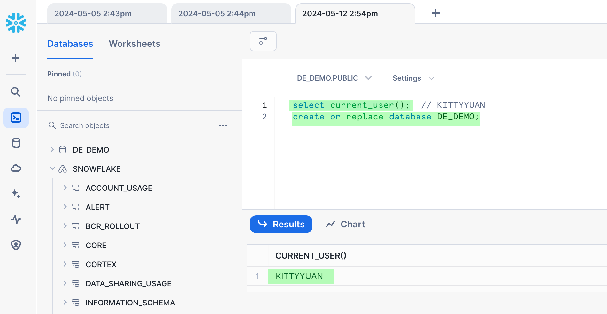
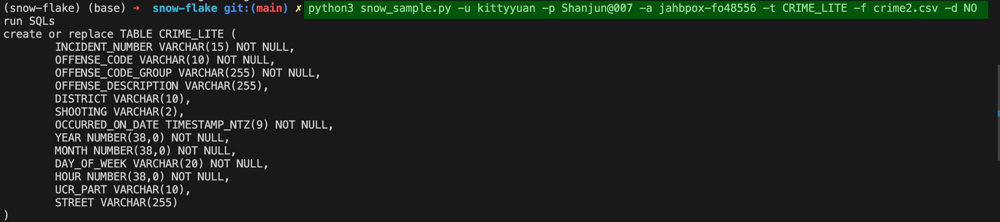
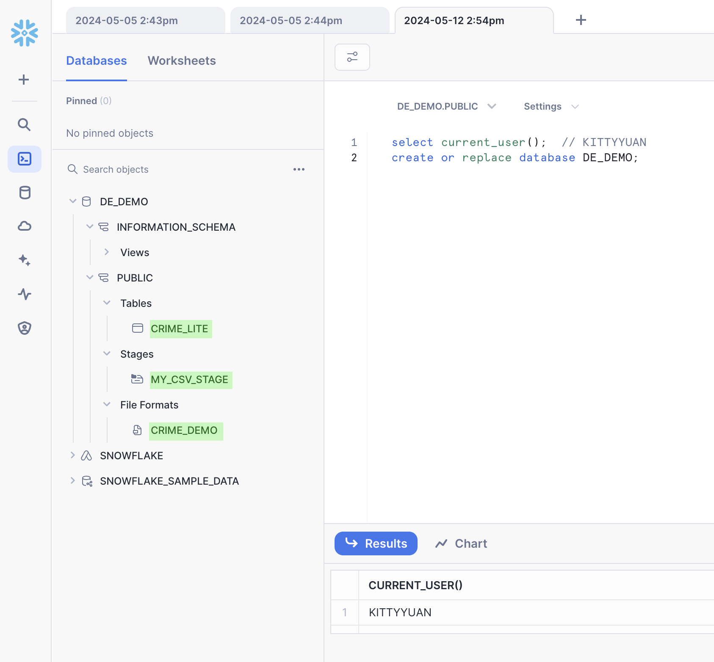
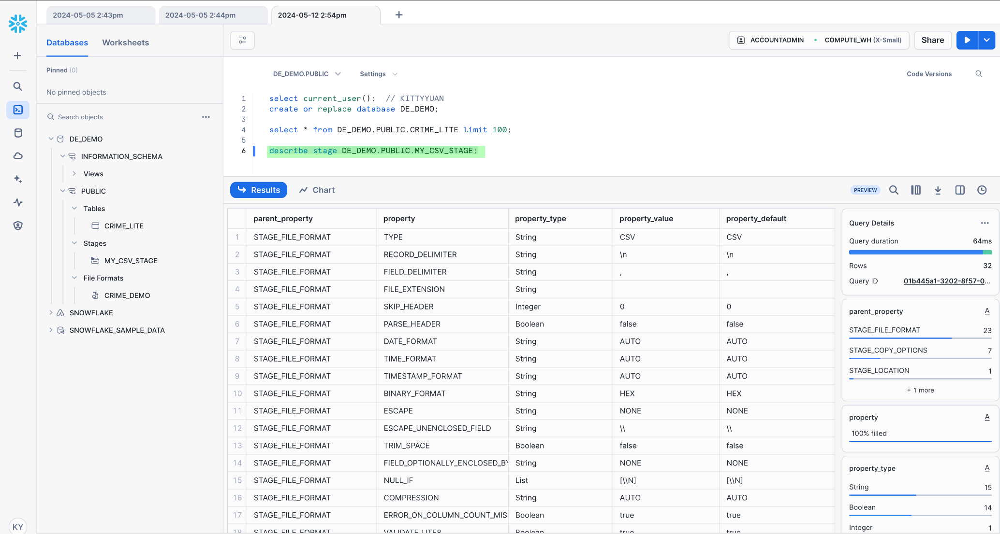
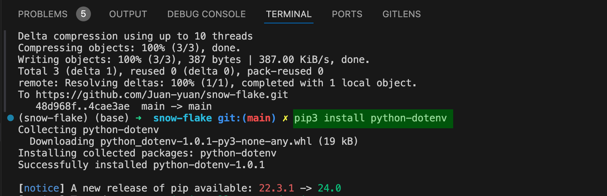
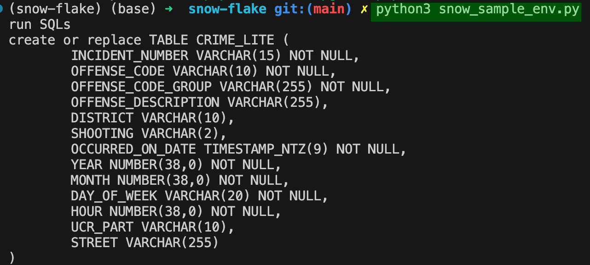
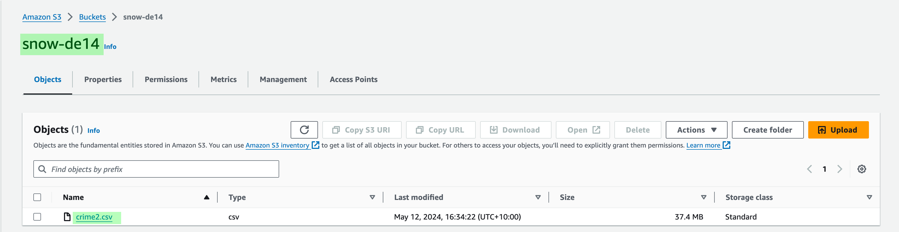
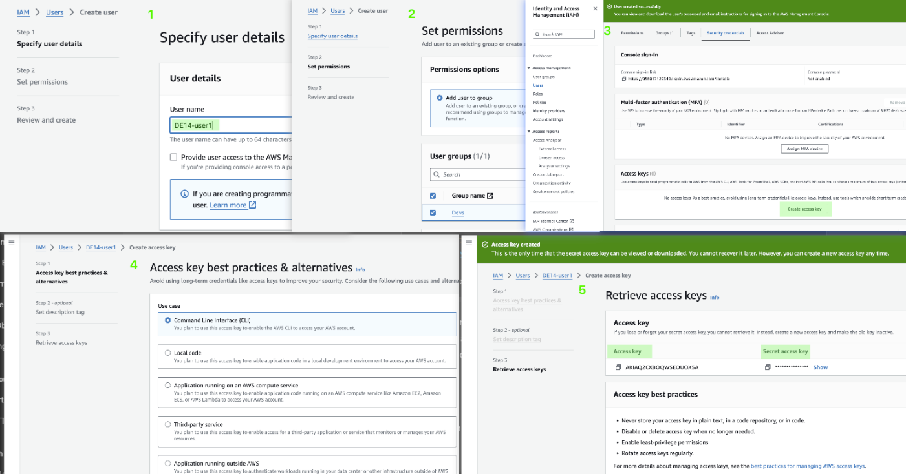
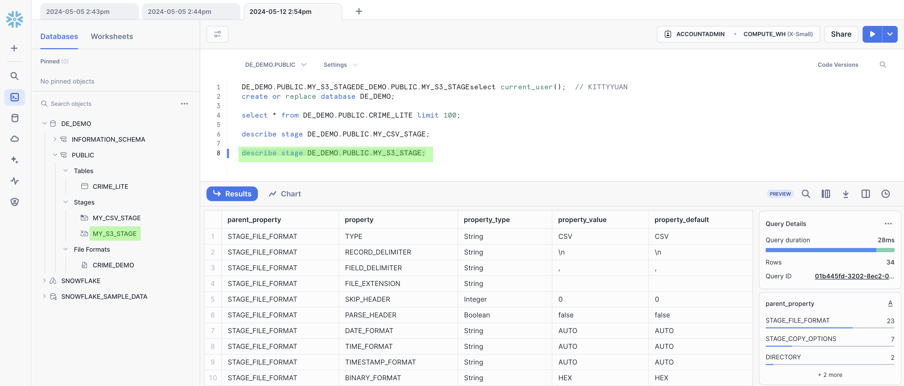
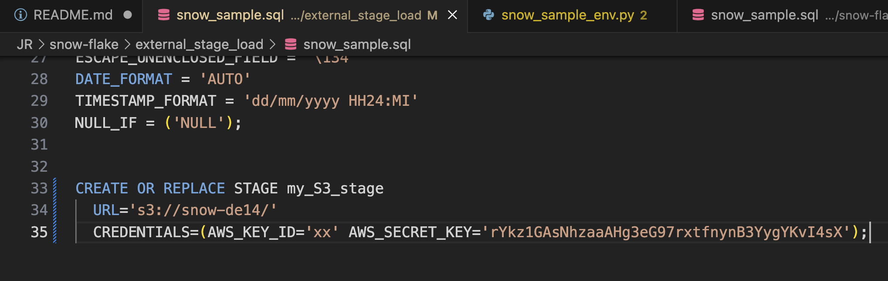

## Let's start
### Way 1: Upload data internally to Snowflake
1. run command to init project: python3 -m venv .
2. install snowflake-connector-python: pip3 install snowflake-connector-python
3. activate project: source bin/activate
4. login into your snow flake account, create a database: 

5. run command to connect your snow flake: python3 snow_sample.py -u kittyyuan -p Shanjun@007 -a jahbpox-fo48556 -t CRIME_LITE -f crime2.csv -d NO

6. check snow flake, we can see the tables, stages and file firmats are there:

7. select CRIME_LITE table values and stages:

8. create a .env file with values:
  SF_USER=kittyyuan
  PASSWORD=Shanjun@007
  ACCOUNT=jahbpox-fo48556
  TABLE=CRIME_LITE
  FILE=crime2.csv
  TRUNCATE=YES
9. install package run command:  pip3 install python-dotenv

10. run command to execute snow_sample_env.py file, command: python3 snow_sample_env.py

### Way 2: Upload data externally(AWS s3) to Snowflake
1. run command: cd external_stage_load
2. go to your AWS console, create a bucket in S3 and upload file crime2.csv into this bucket:

3. go to your AWS IAM, create a new user to get the key id and password and put values into snow_sample.sql file STAGE my_S3_stage

4. run command: python3 snow_sample_external.py
5. re-load snow flake, we can see crime2.csv values are successfully uploaded into snow flake MY_S3_STAGE file.

6. add key id and password to snow_sample.sql under external_stage_load folder

